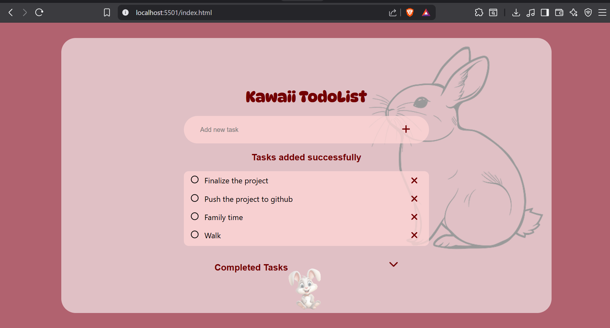
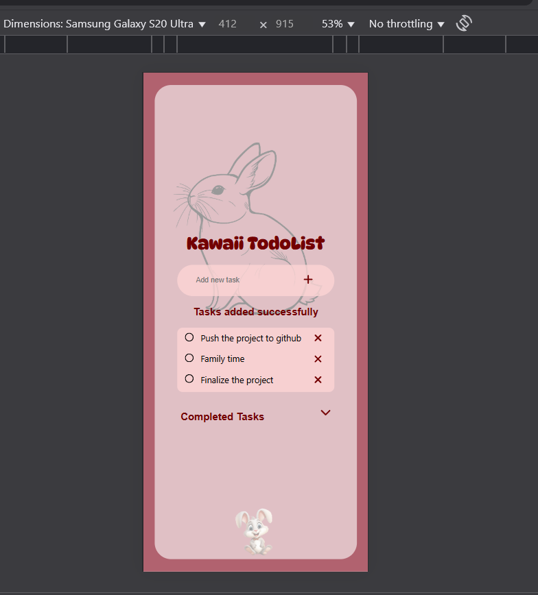
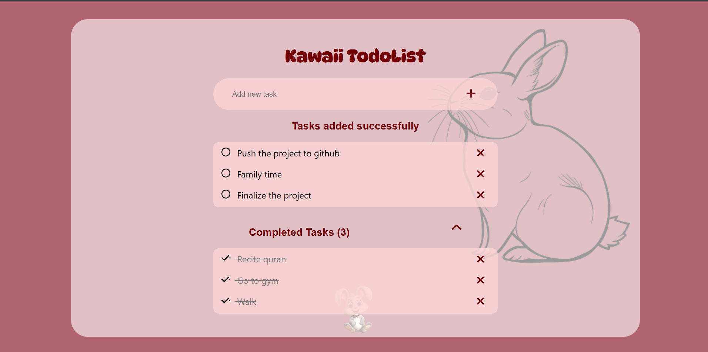
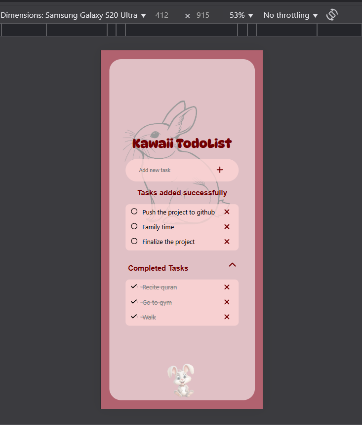

# 🐰 Kawaii TodoList — Fully Functional Version

A cute, responsive, and now fully interactive Todo List web app built with **HTML**, **CSS**, and **JavaScript**. Inspired by soft pastel aesthetics and kawaii visuals, this project allows users to add, complete, and remove tasks — all stored in the browser using **localStorage**.

---

## 🎯 Features

- ✅ Add new tasks
- 🎯 Mark tasks as completed (with line-through and checkmark)
- ♻️ Move tasks back to the active list from completed
- 🗑️ Remove tasks from both lists
- 💾 Saves tasks across sessions using localStorage
- 📱 Fully responsive (mobile-friendly)
- 🐇 Cute bunny theme + SVG icons from sprite sheets

---

## 🖼️ Screenshots

| Desktop View | Mobile View |
|--------------|-------------|
|  |  |

| Adding a Task | Completed Tasks Tab |
|---------------|---------------------|
|  |  |

---

## 🛠️ Built With

- **HTML5** – semantic and accessible structure
- **CSS3** – responsive design, flexbox, and media queries
- **JavaScript** – DOM manipulation, event delegation, localStorage
- **SVG Sprites** – used for icons like add, delete, and check
- **Google Fonts** – custom typography with DynaPuff

---

## 🧠 What I Learned

- Building interactivity with **vanilla JavaScript** — including DOM events, localStorage, and toggling classes dynamically.
- Managing tasks between active and completed states while maintaining a clean user experience.
- Improving my understanding of **event delegation** and **closest()**, especially when dealing with dynamic elements.
- Structuring reusable SVG icons using **sprite-based references** with `<use>`, which kept my assets light and scalable.

---

## 📂 Folder Structure

📁 assets/
├─ svg-sprite.svg
├─ big_bunney.png
├─ little_bunney.png
└─ screenshots/
├─ desktop-1.png
├─ mobile-1.png
├─ adding-task.png
└─ completed-tasks.png

📁 css/
└─ style.css

📁 js/
└─ main.js

📄 index.html

## 🚀 Getting Started

1. Clone the repository  
   git clone https://github.com/ammarsabit/kawaii-todo-list.git
2. Open index.html in your browser
3. That's it! Tasks you add will persist using localStorage

